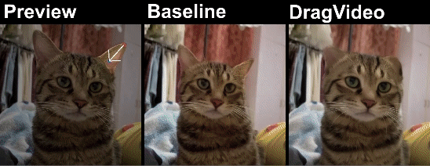

<p align="center">
  <h1 align="center">DragVideo: Interactive Drag-style Video Editing</h1>
  <p align="center">
    <a href="https://yfde.cc/"><strong>Yufan Deng</strong></a>
    &nbsp;&nbsp;
    <a href="https://github.com/RickySkywalker"><strong>Ruida Wang</strong></a>
    &nbsp;&nbsp;
    <a href="https://yzhanglp.github.io/"><strong>Yuhao Zhang</strong></a>
    &nbsp;&nbsp;
    <a href="https://yuwingtai.github.io/"><strong>Yu-Wing Tai</strong></a>
    &nbsp;&nbsp;
    <a href="http://www.cs.ust.hk/~cktang/"><strong>Chi-Keung Tang</strong></a>
  </p>
  <p align="center">
    <a href="https://arxiv.org/abs/2312.02216"></a>
    <a href="https://dragvideo.github.io/"></a>
  </p>
  <div align="center">
    
  </div>
  
  <!-- <div align="center">
    <video src="https://github.com/RickySkywalker/DragVideo-Official/assets/68608377/13a0a9ff-3957-475d-9838-83d581fc3e6c.mp4">
  </div> -->
  <br>
</p>

## Updates
- [2024/09/25] Code released at branch `release`
- [2024/07/04] Accepted by ECCV2024

## Quick Start

1. Setup environment
```bash
conda env create -f environment.yaml
conda activate dragvideo
```

2. Download weights
```bash
cd pips
sh get_reference_model.sh
cd ..
```

3. Start the UI
```bash
python drag_ui.py
```

4. Currently, the UI only supports square video input. Videos we used can be downloaded at [Google Drive](https://drive.google.com/drive/folders/1CU3pVRFyRoVln7RuWl5dhlbfjlyYzOAX?usp=sharing). 

## UI Demo
<p align="center">
  <video src="https://github.com/RickySkywalker/DragVideo-Official/assets/68608377/1ed23d2f-34dd-4309-8bea-6ff49446d338.mp4">
</p>


## BibTeX
```
@article{deng2023dragvideo,
      title={Dragvideo: Interactive drag-style video editing},
      author={Deng, Yufan and Wang, Ruida and Zhang, Yuhao and Tai, Yu-Wing and Tang, Chi-Keung},
      journal={arXiv preprint arXiv:2312.02216},
      year={2023}
      }
```

## Acknowledgements
Folder `./AnimateDiff` is from [AnimateDiff](https://github.com/guoyww/AnimateDiff)\
Folder `./pips` is from [pips](https://github.com/aharley/pips)\
Folder `./TrackAnything` is from [Track-Anything](https://github.com/gaomingqi/Track-Anything)\
DragVideo codebase built upon [DragDiffusion](https://github.com/Yujun-Shi/DragDiffusion)
