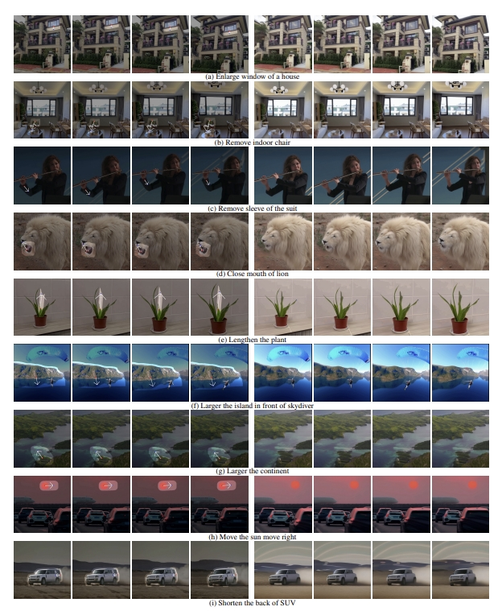
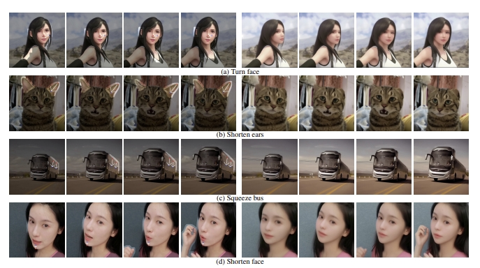

# DragVideo: Interactive Drag-style Video Editing
[Yufan Deng](https://yfde.cc/),
[Ruida Wang](https://github.com/RickySkywalker),
[Yuhao Zhang](https://yzhanglp.github.io/),

[arXiv Link]()

---

  

DragonVideo enables drag-style editingfor the videos while preserve the temporal consistency of the video.

## Updates

- [2023/12/5] Paper is available [here]().

---

## Introduction
In this paper, we propose DragVideo, where the drag-style user
interaction is adopted to edit video content while maintain-
ing temporal consistency. We also develop a user interface with gradio,
The code will release soon.

## More Examples

  

  

##UI Demo

<video src="assets/UI.mp4" controls></video>

